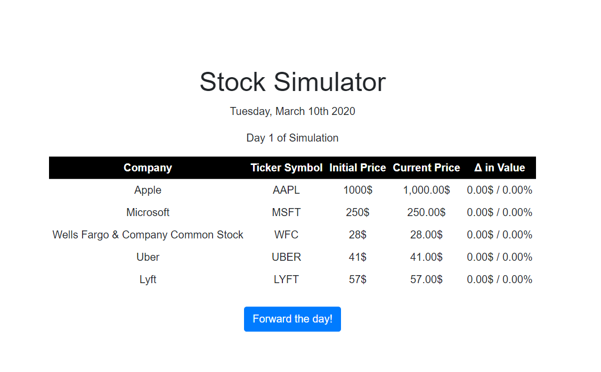

# StockSimulator

[Link to the Github Repo!](https://github.com/DarrylJLTolentino/StockSimulator)

## Description

This website features an Angular 2+ application that is a simple stock simulator game. There are five companies with stock values from the link: 'https://staging-api.brainbase.com/stocks.php'. The full name of the company, the ticker symbol, the initial value, current value, and the change in value to-date are displayed on a table. The table is styled with MDBootstrap. The title and the current date are given at the top of the website. The date is formatted using MomentsJs. 

After pressing the "Forward the day button!", the day counter on the website will forward by one and the value of each company will rise or fall a range of -10% to +10%. The current value and the change in value to-date change with the button click. The current date and amount of days will also change on button click.

| Technologies Used | References |
| ----------------- | ---------- |
| HTML | https://developer.mozilla.org/en-US/docs/Web/HTML |
| CSS | https://developer.mozilla.org/en-US/docs/Web/CSS |
| MDBootstrap | https://mdbootstrap.com/docs/angular/ |
| JavaScript | https://developer.mozilla.org/en-US/docs/Web/Javascript |
| TypeScript | https://www.typescriptlang.org/ |
| Angular 2+ | https://angular.io/start |
| Moment.js | https://momentjs.com/ |
| Nodejs | https://nodejs.org/en/ |

| Versioning | References |
| ---------- | ---------- |
| Github | https://github.com/ |

Authors
- Darryl Tolentino

This project was generated with [Angular CLI](https://github.com/angular/angular-cli) version 9.0.5.

## Development server

Run `ng serve` for a dev server. Navigate to `http://localhost:4200/`. The app will automatically reload if you change any of the source files.

## Code scaffolding

Run `ng generate component component-name` to generate a new component. You can also use `ng generate directive|pipe|service|class|guard|interface|enum|module`.

## Build

Run `ng build` to build the project. The build artifacts will be stored in the `dist/` directory. Use the `--prod` flag for a production build.

## Running unit tests

Run `ng test` to execute the unit tests via [Karma](https://karma-runner.github.io).

## Running end-to-end tests

Run `ng e2e` to execute the end-to-end tests via [Protractor](http://www.protractortest.org/).

## Further help

To get more help on the Angular CLI use `ng help` or go check out the [Angular CLI README](https://github.com/angular/angular-cli/blob/master/README.md).
